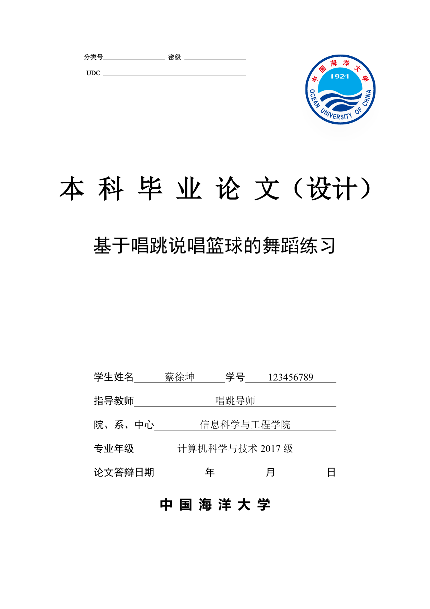
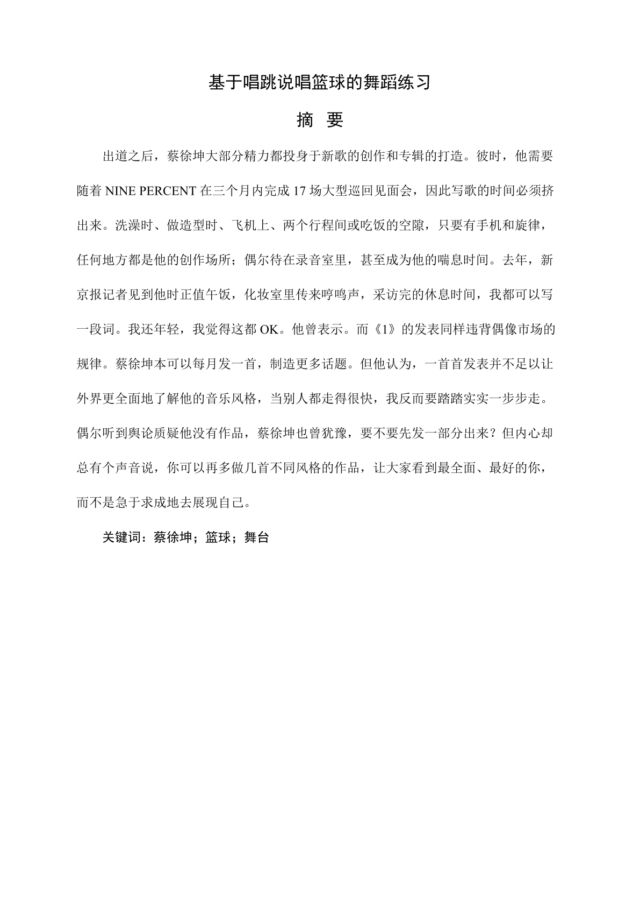
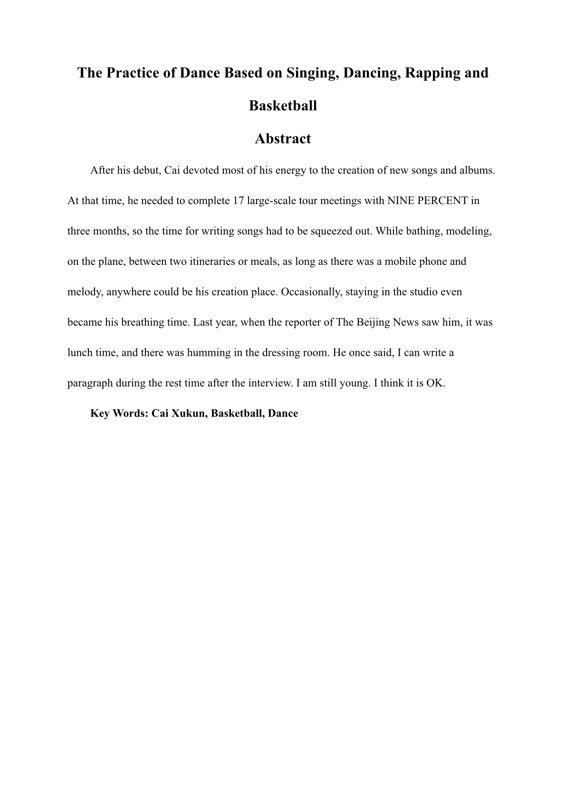
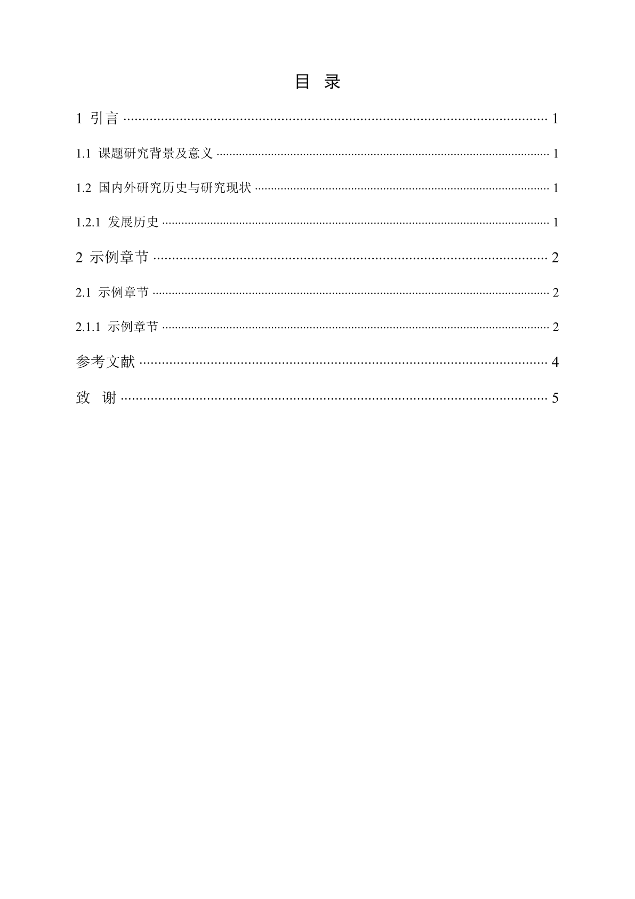
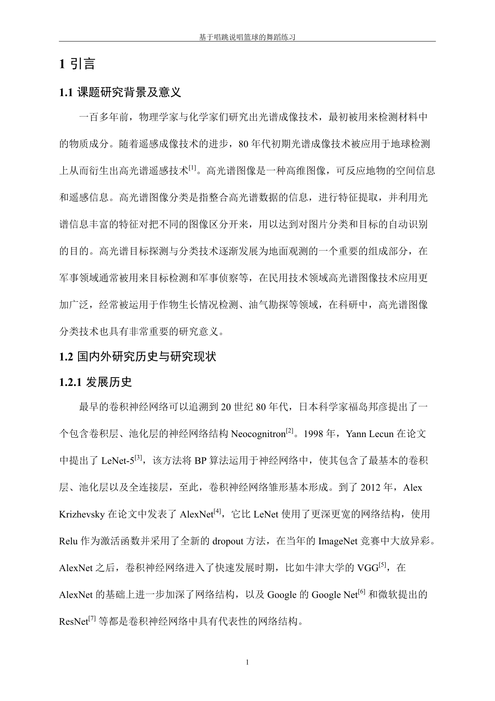
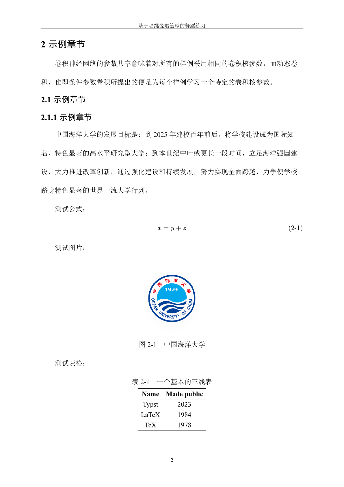
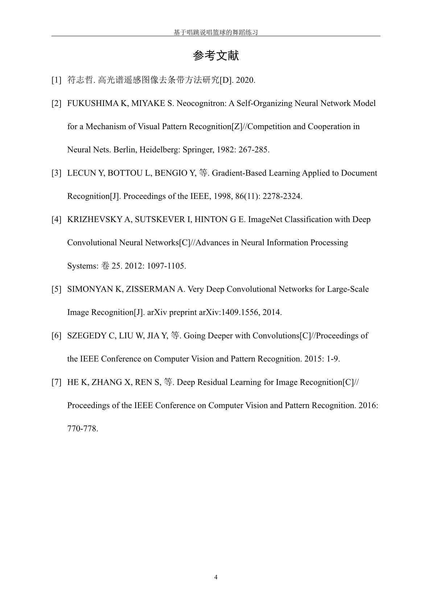
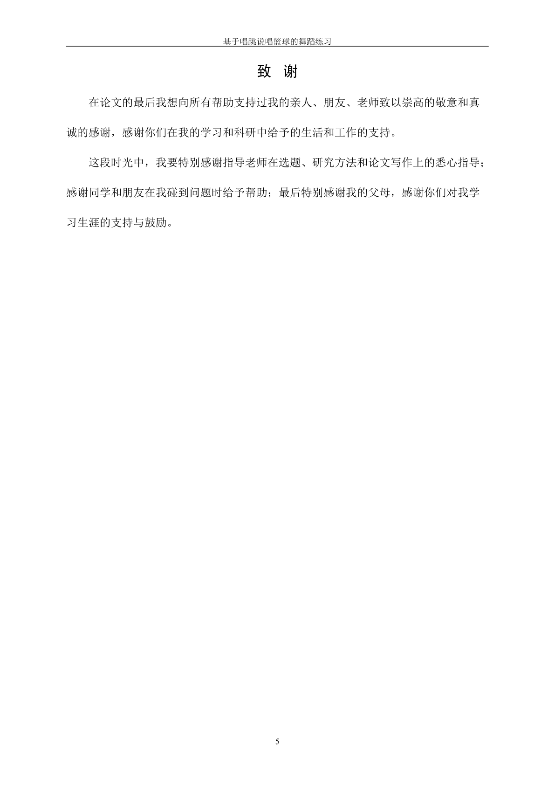

# 中国海洋大学本科毕业论文 Typst 模板 (OUC Bachelor Thesis)

基于 [Typst](https://typst.app/) 编写的中国海洋大学本科毕业论文模板。

## 效果预览

以下是本模板渲染后的论文效果展示。所有预览图片可通过 `examples` 文件夹查看。

<p align="center">
  
  
  
  
</p>

<p align="center">
  
  
  
  
</p>

## 快速开始

首先需要通过 `project.with` 注入论文的基础信息：

```typst
#import "template.typ": project, bibliography, acknowledgments

#show: project.with(
  title: (
    zh: "您的论文中文标题",
    en: "Your Thesis English Title",
  ),
  author: "您的姓名",
  student-id: "学号",
  advisor: "指导教师",
  college: "学院名称",
  department: "专业及年级",
  abstract-content: (
    zh: [ 中文摘要正文... ],
    en: [ English abstract text... ],
  ),
  keywords: (
    zh: ("中文关键字1", "关键字2"),
    en: ("Keyword1", "Keyword2"),
  ),
)

// =========
// 正文写作部分
// =========
= 引言
...
```

## 目录结构

如果需要对模板样式进行深度定制，可以了解本模板的结构划分：

```text
.
├── typst.toml              # 包的元数据信息
├── main.typ                # 示例论文
├── template.typ            # (核心) 模板导出中心组件，暴露黑盒接口
├── references.bib          # 示例参考文献 BibTeX 数据库
├── components/             # 页面排版组件：封面、摘要、目录、致谢等
├── utils/                  # 工具类：字体处理、页码/标题编号、内置三线表等
├── assets/                 # 核心静态资源库（如校徽 Logo 等）
└── README.md
```

## 许可证

本项目使用 [MIT License](LICENSE) 开源许可证。
